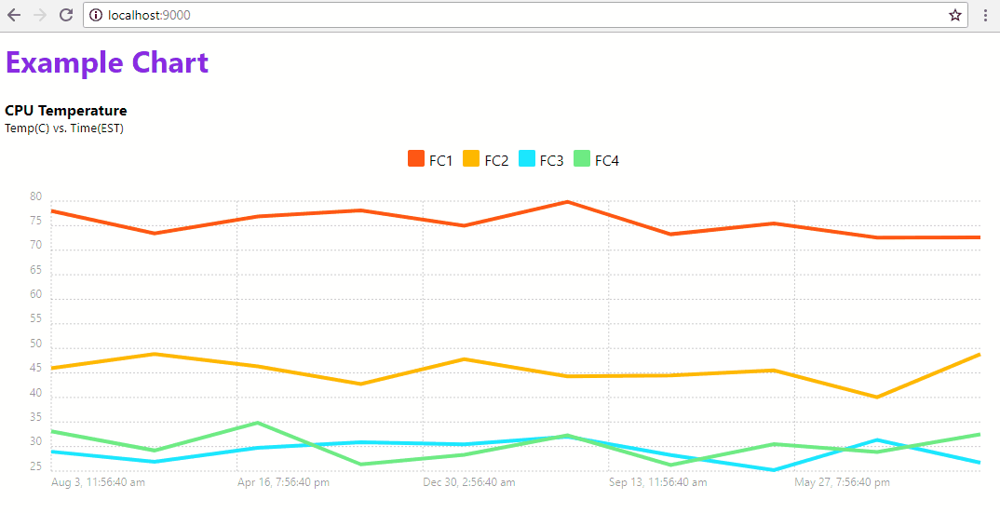

# Socket.io streaming data to Chartist.js

Bare-bones flask app using socket.io to stream data to client drawing charts with Chartist.js!

This example is ready to rock and roll! Install required python packages and run `main.py`. From there start hacking and make something amazing!

## Python dependencies
* flask 
* flask_socketio
* eventlet (required for server-side emit)